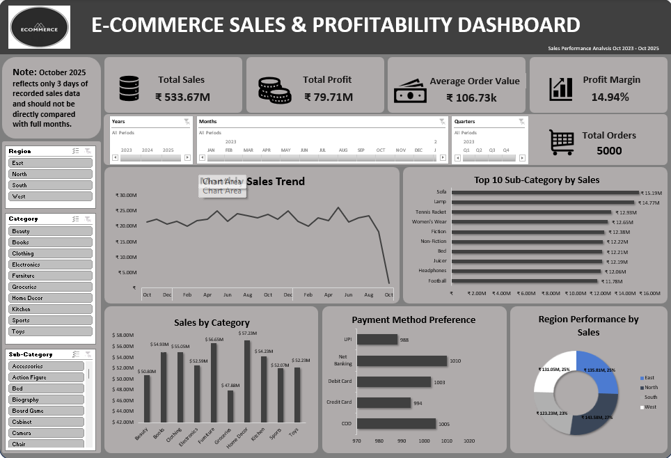

# E-Commerce_Sales_Profitability_Analysis
E-commerce sales and profitability analysis using Microsoft Excel
# E-Commerce Sales & Profitability Analysis

E-commerce sales and profitability analysis using Microsoft Excel.

## Project Overview

This project analyzes e-commerce transaction data to evaluate sales performance, profitability, customer payment preferences, product performance, and regional sales.

The analysis was conducted using Microsoft Excel, with a focus on data cleaning, PivotTables, KPI calculations, data visualization, and dashboard development.

## Data Period

**October 4, 2023 – October 3, 2025**

## Tools Used

- Microsoft Excel
- PivotTables
- Excel Charts
- Data Cleaning
- Data Analysis
- Dashboard Development

## Key KPIs

- **Total Sales:** ₹533.67M
- **Total Profit:** ₹79.71M
- **Profit Margin:** 14.94%
- **Average Order Value:** ₹106,733.20
- **Total Orders:** 5,000

## Analysis Performed

- Monthly Sales Trend
- Sales by Category
- Top 10 Sub-Categories by Sales
- Regional Sales Performance
- Payment Method Preference
- Profitability Analysis
- Average Order Value

## Key Insights

1. The business generated ₹533.67M in sales and ₹79.71M in profit, resulting in an overall profit margin of 14.94%.
2. Home Decor recorded the highest category sales, while Groceries recorded the lowest.
3. Sofa and Lamp were among the top-performing sub-categories by sales.
4. Payment methods were relatively evenly distributed, with Net Banking recording the highest number of orders.
5. Sales were relatively balanced across regions, with the West region performing strongest.
6. Monthly sales fluctuated throughout the period. October 2025 shows a sharp decline because only three days of sales data were recorded.
7. The Average Order Value was approximately ₹106.73K, presenting an opportunity to increase revenue per transaction.

## Recommendations

- Improve profitability through better cost control, pricing strategies, and evaluation of discounts.
- Maintain adequate inventory and marketing support for high-performing categories and sub-categories.
- Investigate the factors contributing to lower-performing categories such as Groceries.
- Continue offering multiple payment options to provide customers with flexibility at checkout.
- Develop targeted strategies to improve performance in weaker regions.
- Use complete months when comparing monthly sales performance.
- Increase Average Order Value through product bundling, cross-selling, and complementary-product recommendations.

## Data Limitation

October 2023 and October 2025 contain partial-month data. October 2025 contains only three days of recorded transactions and should therefore not be directly compared with complete months.

## Dashboard

The project includes an interactive Excel dashboard containing KPI cards, sales trends, category and sub-category analysis, regional performance, and payment method analysis.

